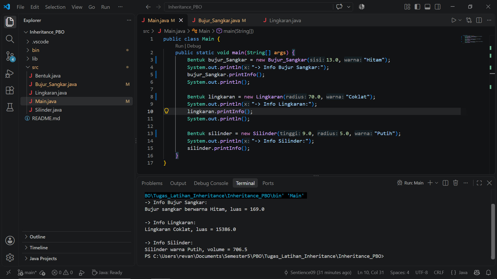

# Tugas 5C - Latihan/Eksplorasi Materi Inheritance dan Polymorphism

**Nama:** Revano Januar Adiguna Prawira
**NIM:** F1D02410146

---

## 1. Enkapsulasi
* **Letak pada Kode:** 
  Penerapan ini terlihat dari penggunaan kata `protected` pada variabel, seperti `protected double sisi` pada kelas `BujurSangkar` dan `protected double radius` pada kelas `Lingkaran`. Untuk mengakses nilai tersebut dari kelas `Main`, saya menggunakan metode *getter* (misal: `getSisi()`) dan *setter* (misal: `setSisi()`).

## 2. Pewarisan
* **Letak pada Kode:**
  Penerapan ini ditandai dengan penggunaan kata `extends`. Contohnya pada baris `class BujurSangkar extends Bentuk` dan `class Lingkaran extends Bentuk`. Ada juga pewarisan bertingkat pada baris `class Silinder extends Lingkaran`. Di dalam pembuatannya (*constructor*), kelas anak menggunakan perintah `super()` untuk memanggil fungsi dari kelas induknya.

## 3. Polimorfisme
* **Letak pada Kode:**
  Ini terjadi pada metode `printInfo()`. Kelas induk `Bentuk` punya metode ini, lalu kelas anak (`BujurSangkar`, `Lingkaran`, `Silinder`) membuat ulang metode tersebut dengan menambahkan tulisan. Akibatnya, saat `printInfo()` dipanggil di kelas `Main`, kalimat yang dicetak bisa beda-beda (ada yang mencetak luas, ada yang mencetak volume) sesuai dengan bentuk objeknya.

---

## Screenshot Hasil Eksekusi
Berikut adalah bukti saat program dijalankan:

## Getting Started

Welcome to the VS Code Java world. Here is a guideline to help you get started to write Java code in Visual Studio Code.

## Folder Structure

The workspace contains two folders by default, where:

- `src`: the folder to maintain sources
- `lib`: the folder to maintain dependencies

Meanwhile, the compiled output files will be generated in the `bin` folder by default.

> If you want to customize the folder structure, open `.vscode/settings.json` and update the related settings there.

## Dependency Management

The `JAVA PROJECTS` view allows you to manage your dependencies. More details can be found [here](https://github.com/microsoft/vscode-java-dependency#manage-dependencies).
